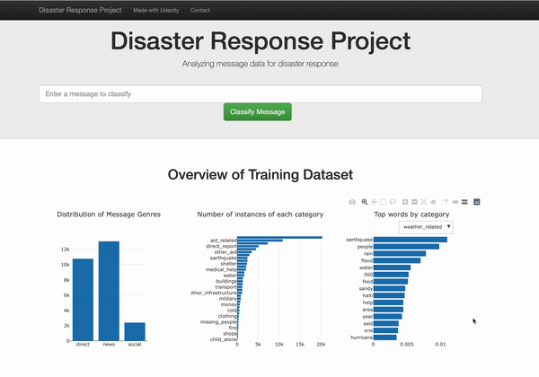

# Disaster Response Pipeline Project
The project analyses thousands of real messages sent during natural disasters and classifies them into 36 categories of required assistance. Such messages are collected either via social media or directly to disaster response organizations. The results can support different organizations to detect the most relevant messages requiring assistance.


---

The project consists of three sections:
1. ETL pipeline
2. Machine learning pipeline
3. Web application with Flask

## Instructions
1. Run the following commands in the project's root directory to set up your database and model.

    - To run ETL pipeline that cleans data and stores in database
        `python data/process_data.py data/disaster_messages.csv data/disaster_categories.csv data/DisasterResponse.db`
    - To run ML pipeline that trains classifier and saves
        `python models/train_classifier.py data/DisasterResponse.db models/classifier.pkl`

2. Go to `app` directory: `cd app`

3. Run your web app: `python run.py`

## Requirements
The [requirements.txt](./requirements.txt) file contains the libraries needed for the project.

You can create a virtual environment for the project with:
```bash
git clone <repo>
cd <repo>
python -m venv venv
source venv/bin/activate
pip install -r requirements.txt
```

## File descriptions

- [app/run.py](app/run): The main Flask file for the web application to interact with disaster messages and categories.
- [data/process_data.py](data/process_data.py): ETL pipeline that processes message and category data from CSV files and load them into a SQLite database.
- [models/train_classifier.py](models/train_classifier.py): A Machine Learning pipeline that reads from the database to create and save a multi-output supervised learning model that classifies disaster messages into 36 categories.


## Acknowledgements
This project is part of Udacity's [Data Scientist program](https://www.udacity.com/course/data-scientist-nanodegree--nd025).

Dataset credit:
    https://appen.com/ (formerly Figure 8)